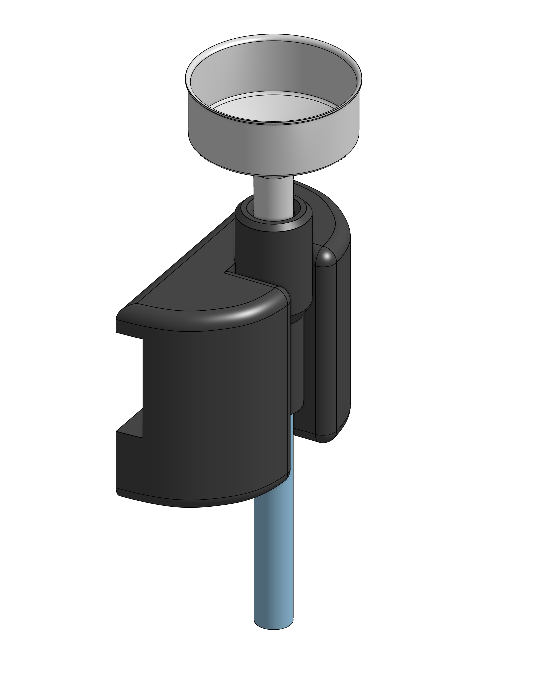

* Moka Pot Funnel Clearing System
*Problem:* there's no good way to get used Moka pot grounds puck out of the funnel. Existing methods have unacceptable downsides:
1. *Method 1:* blowing into the funnel. This is unsanitary, particularly cause the funnel is rarely washed. This is also awkward since the user must bend down over the trash.
2. *Method 2:* banging the funnel against the trash can wall. This is slightly unsanitary. This is also mechanically damaging.
2. *Method 3:* quickly snapping the funnel in the air over the trash can to dislodge the puck and have it land in the trash. If you miss, you must clean a bunch of espresso grounds off the floor. The process has high risk of error because each puck sticks into the funnel slightly differently.

*Solution:* use Method 1 but replace the human with an foot-actuated air pump.

Onshape link: [[https://cad.onshape.com/documents/1cc0ca99113a1dbb41a37d99/w/9d083b5dbfdb6ef9a2e9031e/e/23418b7f4e0655204f3c2b57][cad.onshape.com/documents/1cc0ca99113a1dbb41a37d99/w/9d083b5dbfdb6ef9a2e9031e/e/23418b7f4e0655204f3c2b57]] 

The handle rests in a countertop mount.

*Usage:*
1. Lift the nozzle out from the mount and orient towards trash.
2. Insert funnel into nozzle.
3. Step on air pump.
4. Put the nozzle back in the mount.

*Purchase Cost:* $18.
1. $8 for the [[https://www.amazon.com/dp/B07NQSNBTG][tube]].
2. $9 for the [[https://www.amazon.com/dp/B07JV7KBXM][pump]].
3. $1 for the 3D print.

You're buying 10ft of tube, but you'll probably only use about half or $4 worth, so the cost of the system, in terms of materials, is only $14.

If you already have a stiff tube, use that.

I would not buy a smaller pump. Your tube holds still air, and a smaller pump may not hold enough volume to displace the still air in the tube at the required pressure, albeit low pressure.
